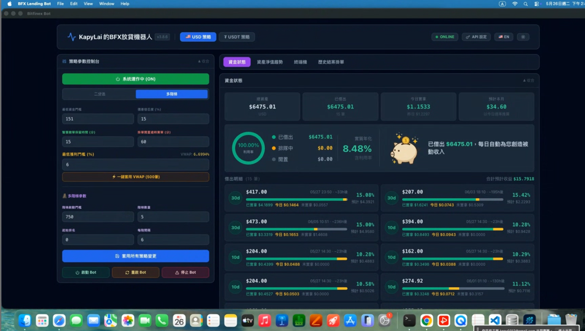

# BFX Lending Bot

> Bitfinex P2P 放貸自動化桌面應用 — 跨平台商業產品，透過 [Whop](https://whop.com) 平台授權銷售。


---

## 概覽

BFX Lending Bot 是一款針對 Bitfinex 放貸市場設計的自動化工具，支援 fUSD、fUST、fBTC 多幣種並行操作。從市場深度分析到掛單執行、收益對帳，全流程自動化，適合需要 24/7 不間斷運行的放貸用戶。

此為 **私人原始碼的商業產品**，本 repo 僅作為作品集說明用途，不包含任何程式碼。

---

## 截圖



---

## 核心功能

### 智慧掛單引擎

- **二分法（Binary）** 與 **多階梯（Ladder）** 雙策略模式，依資金量自動切換
- **Smart Gap Detection**：分析 Orderbook 深度，鎖定斷層位置掛單，搶佔利率優勢
- **VWAP 追價**：15 分鐘成交量加權均價追蹤，冷啟動期自動延長至 120 分鐘
- **Volatility Index**：波動率溢價層，行情劇烈時自動拉高掛單利率
- **EMA 持久化**：基準利率指數移動平均值寫入 SQLite，重啟後無縫恢復
- **利率保底機制**：行情低迷時以設定底價排隊，避免低於最小獲利率掛出

### 自動化控制

- **四種撤單判斷**：TIMEOUT / LOW_APR / BOT（被機器人搶走）/ UNDERCUT（利率被壓低）
- **成交偵測（detectFilledOffers）**：DB 快照 vs 即時清單比對，精確識別成交
- **商業級雙層 Watchdog**：心跳監控（每 1 分鐘）+ 全量同步（每 5 分鐘）
- **WS 斷線自動重啟**：WebSocket 死亡超過 3 分鐘觸發自殺重啟
- **Lending API 健康監控**：連續 3 次失敗自動暫停策略，防止惡化

### 收益追蹤與對帳

- **LedgerView 收益對帳**：按日顯示 Bitfinex 官方 Ledger 實收，100% 與官方報表吻合
- **credit_lifecycle 追蹤**：自動記錄每筆放貸完整生命週期（開始時間、結束時間、提早解約判斷）
- **小時加權推估**：支援首日/末日部分計息、提早解約情境，推估誤差 < 5%
- **realAPR 計算**：基於 Ledger 實際收益反推年化報酬率（非理論名目值）
- **UTC 01:30 結算對齊**：貼合 Bitfinex 每日結算週期，解決台灣時間 08:00–09:30 顯示異常

### 安全性與授權

- **OS 層級金鑰加密**：Electron `safeStorage` 綁定 Windows 登入帳號，API Key 不以明文存放
- **Whop 授權驗證**：啟動時線上驗證 License Key，授權失效自動停止
- **API 安全健檢**：偵測 Bitfinex API Key 是否帶有提領等危險權限
- **EULA 同意記錄**：首次啟動顯示免責聲明，同意記錄寫入 DB

---

## 技術架構

```
┌─────────────────────────────────────────────────────┐
│                   Electron Main Process              │
│  ┌──────────────┐  ┌──────────────┐  ┌───────────┐ │
│  │   main.js    │  │  bot-runner  │  │ server.js │ │
│  │ (App lifecycle│  │ (Bot engine) │  │ (IPC API) │ │
│  └──────────────┘  └──────────────┘  └───────────┘ │
│                          │                           │
│                    ┌─────▼──────┐                   │
│                    │  SQLite DB │                   │
│                    │ (WAL mode) │                   │
│                    └────────────┘                   │
└──────────────────────────┬──────────────────────────┘
                           │ IPC / Socket.IO
┌──────────────────────────▼──────────────────────────┐
│                  React Frontend (Vite)               │
│  ActiveOffersPanel │ HistoryPanel │ SettingsPanel    │
│  AnalysisPanel     │ LedgerView   │ SystemLog        │
└─────────────────────────────────────────────────────┘
```

### 資料庫 Schema（概念層）

| 資料表 | 用途 |
|---|---|
| `offers` | 歷史掛單記錄 |
| `active_offers` | 即時放貸快照 |
| `credit_lifecycle` | 放貸生命週期追蹤（開/關時間、提早解約） |
| `bot_settings` | 各幣種策略參數 |
| `system_log` | 運行日誌（90 天自動清理） |

---

## 多幣種並行

同時管理最多 3 個貨幣的獨立策略實例：

| 幣種 | 說明 |
|---|---|
| `fUSD` | 美元放貸（主力） |
| `fUST` | Tether (USDt) 放貸 |
| `fBTC` | 比特幣放貸 |

每個幣種有獨立的策略設定、EMA 基準、Watchdog 循環。

---

## CI/CD 流程

```
git tag v3.x.x → push → GitHub Actions 觸發

1. Code Quality Check（Ubuntu）
   └─ npm audit + ESLint

2. Build Windows（Windows runner）
   └─ electron-builder NSIS → .exe 安裝包 → 7z 壓縮

3. Build macOS arm64（macOS runner）
   └─ electron-builder DMG + 安裝輔助腳本 → zip

4. Build macOS x64（macOS runner）
   └─ electron-builder DMG + 安裝輔助腳本 → zip

5. Release（Ubuntu）
   └─ 更新 versions.json → GitHub Release 上傳三平台安裝包
```

---

## 技術選型

| 層 | 技術 | 理由 |
|---|---|---|
| 桌面框架 | Electron v40 | 跨平台 + Node.js 生態 |
| 前端 | React 18 + Vite | 快速開發，HMR 即時預覽 |
| 樣式 | Tailwind CSS (CDN) | 無需建置流程，適合 Electron |
| 資料庫 | better-sqlite3 (WAL) | 同步 API，高效能，WAL 解鎖多讀 |
| 加密 | Electron safeStorage | OS 層級，金鑰不落地 |
| 授權 | Whop API | 現成商業授權基礎設施 |
| 日誌 | Winston + daily-rotate | 結構化 log，自動輪換 |
| 打包保護 | javascript-obfuscator | 混淆核心策略邏輯 |
| CI/CD | GitHub Actions | 多平台矩陣建置，tag 觸發自動發版 |

---

## 商業資訊

- 透過 [Whop](https://whop.com) 平台銷售，已有付費用戶
- 支援 Windows 10/11（x64）和 macOS 12+（arm64 / x64）
- 原始碼為私人 repository，不對外開放

---

*Built by [Kevin Lai](https://github.com/kapy0312)*